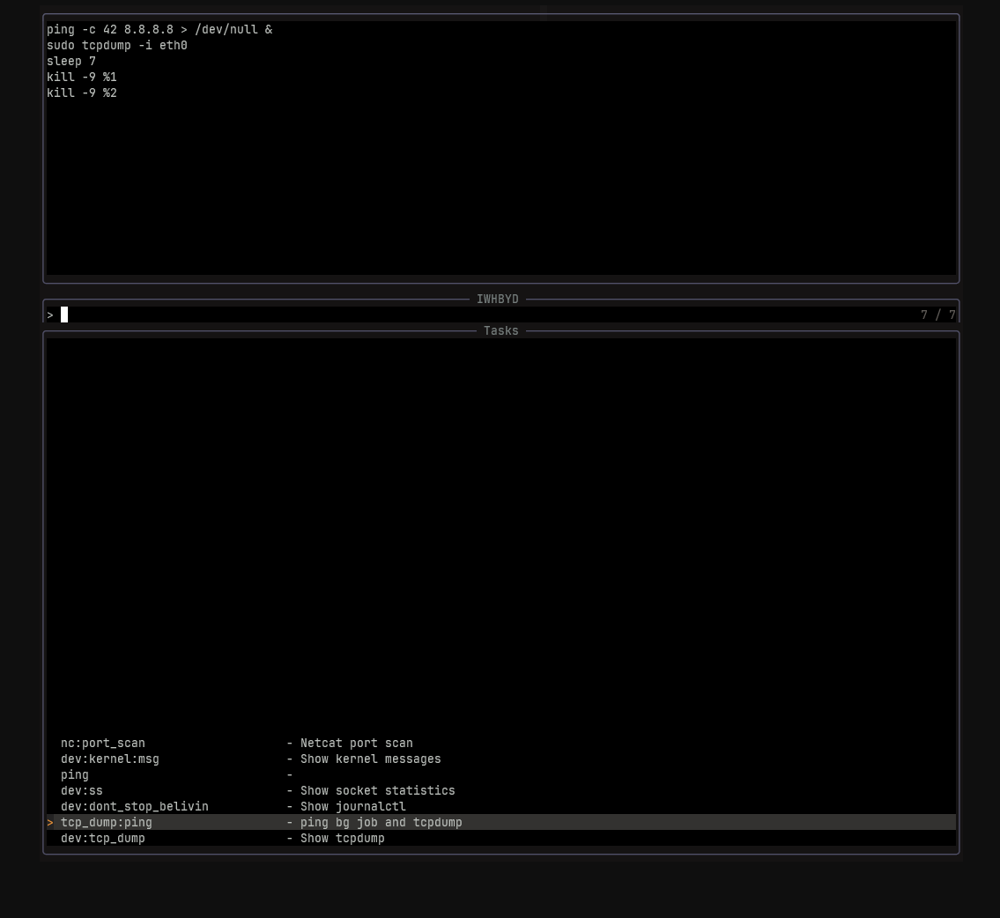

## Taskfile

Get a menu for a [`Taskfile.yml`](https://taskfile.dev/usage/)



### Install

**packer.lua**
```lua
use {
    'moffgato/taskfile.nvim',
    requires = {
        'nvim-telescope/telescope.nvim',
    },
    config = function()
        require('taskfile').setup({
            prompt_title = "IWHBYD",
            layout_strategy = "center",
            winblend = 10,
        })
    end
}
```

**remap.lua**

```lua
vim.keymap.set('n', '<leader>,', ':lua require("taskfile").pick_task()<CR>', { noremap = true, silent = true })
```

**defaults**
```lua
local default_opts = {
    prompt_title = "Don't do it.",
    results_title = "Tasks",
    layout_strategy = 'center',
    width = 0.5,
    height = 0.4,
    border = true,
    borderchars = { '─', '│', '─', '│', '╭', '╮', '╯', '╰' },
    winblend = 10,
}
```

---

### Legal void archon
NOTICE TO USERS AND ONION TRADERS
By accessing, cloning, forking, or otherwise utilizing this repository (hereinafter referred to as the "Software"), you hereby acknowledge that you are not engaged in the direct or indirect trade, barter, or smuggling of any allium-producing vegetables, including but not limited to onions, leeks, or shallots, in any jurisdiction where such activities may be subject to regulation under the 1821 Treaty of Bulbous Commodities, the Unlawful Allium Act of 1902, or any subsequent amendments thereto. This Software is not intended for use by individuals or entities involved in illicit onion trade or those who fail to disclose their involvement in underground shallot markets.

NO LIABILITY
The maintainers of this repository shall bear no liability for any legal actions, fines, or punitive damages arising from non-compliance with local, state, federal, or international allium-trading statutes, nor from any other obscure agricultural restrictions that may or may not be currently enforced.

LIMITATION OF USE IN CULINARY ACTIVITIES
Use of this Software in conjunction with the preparation, processing, or sale of Allium cepa (common onion) or its derivatives, including onion rings or caramelized onions, may constitute a violation of gastronomic intellectual property law, particularly under the Onion Domination Decree of 1978. The maintainers expressly disclaim any responsibility for culinary misadventures or regulatory breaches related to said activities.

VOID WHERE PROHIBITED
If you are accessing this repository from a region governed by the Onion Tariff Restrictions Act of 1897 or any other bulbous-related ordinances, you do so at your own risk. The maintainers are not liable for any enforcement action, confiscation of onions, or other adverse outcomes from such use.

